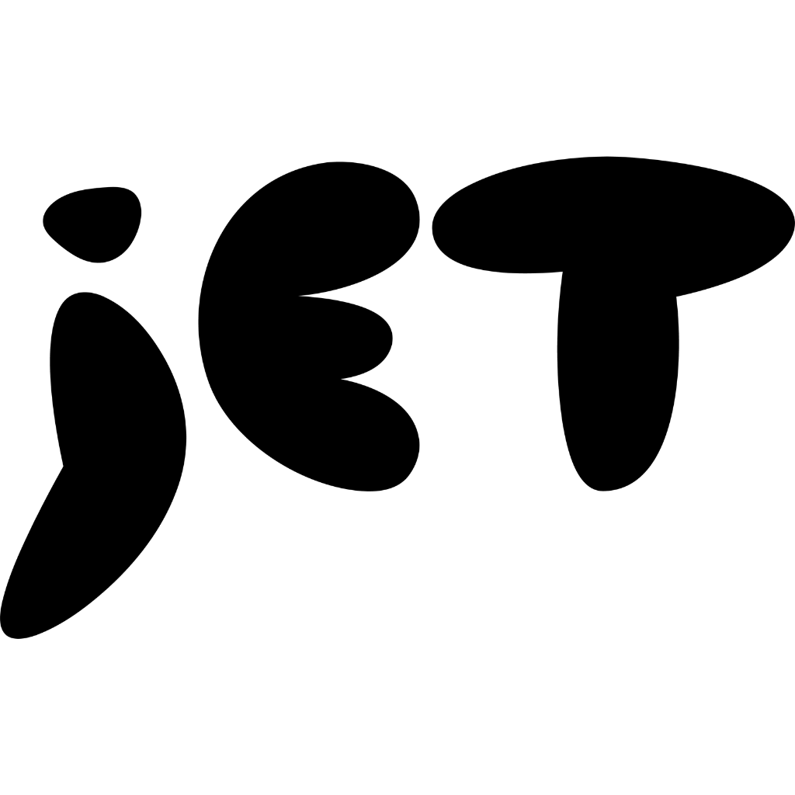

<p align="center">
  
</p>

<h1 align="center">JET — Just Enough Tools</h1>

<p align="center">
  Fast, private, browser-based tools for creators and developers.<br/>
  No uploads. No signups. Everything runs client-side.
</p>

<p align="center">
  
  
  
  
</p>

---

## What is JET?

JET is a collection of browser-based tools built for game developers, pixel artists, and anyone who needs quick file/image processing without leaving the browser. All processing happens locally — your files never leave your machine.

## Tools

### Media
| Tool | Description |
|------|-------------|
| **Format Converter** | Universal file converter — images, video, audio, GIFs, ICO, ICNS, and more |
| **Video to GIF** | Convert video clips (MP4, WebM, MOV) into animated GIFs with trim, FPS, and width controls |
| **Audio Waveform** | Visualize audio files with waveform/frequency views, trim clips with FFmpeg, and export waveform PNGs |

### Image Tools
| Tool | Description |
|------|-------------|
| **Image Upscaler** | High-quality photo/illustration upscaling with Lanczos, bicubic, noise reduction, and sharpening (inspired by [waifu2x](https://github.com/nagadomi/waifu2x)) |
| **Pixel Upscaler** | Smart pixel art upscaling with EPX/Scale2x, xBR, and nearest-neighbor algorithms |
| **Image to Pixel Art** | Convert any image into pixel art with color quantization, dithering, and pixel outlines |
| **Color Tools** | Unified color workspace with tabs for palette extraction, image dithering (Floyd-Steinberg, Atkinson, Sierra, ordered), and palette editing/swapping with built-in presets (PICO-8, Game Boy, NES, Endesga 32, CGA) |

### Sprites
| Tool | Description |
|------|-------------|
| **Sprite Compiler** | Compile individual frames into spritesheets, decompile sheets into frames with row/column filtering, and draw hitbox/collision shapes with JSON export |
| **Sprite to GIF** | Convert spritesheets directly to animated GIFs with ping-pong support |
| **Sprite Recolor** | Swap and replace colors in sprites with per-channel tolerance |
| **3D Spritesheet** | Load FBX/GLB models (Mixamo-compatible), capture from multiple angles with RPG/platformer presets, configurable background and animation selection |
| **Sprite Animator** | Preview spritesheet animations with FPS control, ping-pong, loop, frame range, onion skinning, and GIF export |

### Packing
| Tool | Description |
|------|-------------|
| **Atlas Pack** | Pack multiple sprites into optimized texture atlases with pixel-perfect rendering and JSON metadata (Phaser/PixiJS compatible) |
| **Font Pack** | Generate bitmap font sheets from character sets |
| **Tile Pack** | Build optimized tile packs for game engines |

### World
| Tool | Description |
|------|-------------|
| **Tileset Generator** | Arrange tile images into tilesets with metadata |
| **Map Generator** | Procedural dungeon and overworld map generation with Godot/Unity JSON export |
| **Level Editor** | Tile-based level painting with multiple layers, paint/erase/fill tools, and JSON + PNG export |

### Math
| Tool | Description |
|------|-------------|
| **Probability** | Binomial, Poisson, Hypergeometric, and custom probability distributions with visualization |
| **Matrices** | Matrix multiplication, echelon form, inverse, determinant, cofactors, and systems of equations |

### Automation
| Tool | Description |
|------|-------------|
| **Pipeline** | Chain multiple tools together into automated workflows with full per-step configuration — algorithm selection, color mappings, noise reduction, quality settings, and more |

## Getting Started

### Prerequisites

- Node.js 22+ (latest LTS recommended)
- npm or yarn

### Install & Run

```bash
git clone https://github.com/YOUR_USERNAME/JET.git
cd JET
npm install
npm run dev
```

Open [http://localhost:5173](http://localhost:5173) in your browser.

### Build for Production

```bash
npm run build
npm run preview
```

## Tech Stack

- **React 19** — UI framework
- **Vite 6** — Build tool & dev server
- **TypeScript 5** — Type safety
- **Tailwind CSS v4** — Styling
- **Three.js** — 3D model rendering (FBX/GLB)
- **FFmpeg.wasm** — Client-side video/audio conversion & trimming
- **JSZip** — ZIP generation in browser
- **Lucide** — Icon set
- **React Router** — Client-side routing

## Privacy

All processing happens in your browser. No files are uploaded to any server. Your data stays on your machine.

## Credits

- **[waifu2x](https://github.com/nagadomi/waifu2x)** by nagadomi — Inspiration for Image Upscaler (MIT)
- **[pixel-tools](https://github.com/skhoroshavin/pixel-tools)** by Sergey Khoroshavin — Inspiration for Atlas Pack, Font Pack, Tile Pack, and Recolor (MIT)
- **[Cobalt](https://github.com/imputnet/cobalt)** by imputnet — Social media download API reference (AGPL-3.0)
- **[Mixamo](https://www.mixamo.com)** by Adobe — 3D character models and animations

## Author

Created by **Cosmical Cheese**

Built with assistance from Claude (Anthropic)

## License

MIT
